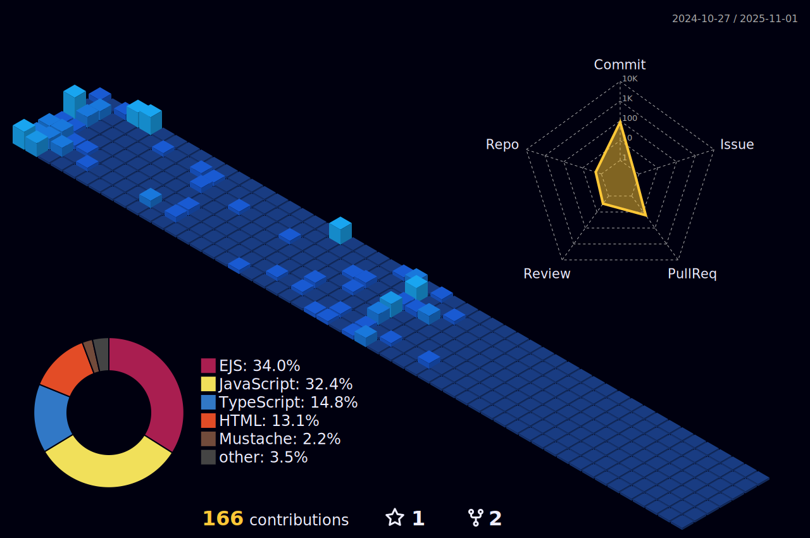

<!-- Profile View -->

<a href="https://github.com/ashutosh00710/github-readme-activity-graph">
<picture>
  <source media="(prefers-color-scheme: dark)" srcset="https://github-readme-activity-graph.vercel.app/graph/?username=angyonghaseyo&bg_color=00000f&color=007bff&line=fac539&point=FFFFFF&hide_border=true">
  
</picture>
</a>

<!-- github-stats -->

<a href="https://github.com/angyonghaseyo/github-stats">
<picture>
  <source media="(prefers-color-scheme: dark)" srcset="https://raw.githubusercontent.com/angyonghaseyo/github-stats/master/generated/overview.svg#gh-dark-mode-only">
  
</picture>
</a>

<a href="https://github.com/angyonghaseyo/github-stats">
<picture>
  <source media="(prefers-color-scheme: dark)" srcset="https://raw.githubusercontent.com/angyonghaseyo/github-stats/master/generated/languages.svg#gh-dark-mode-only">
  
</picture>
</a>

<h1 align="center">Hi there! 👋, I'm Ang Yong 👨🏻‍💻</h1>

<h3 align="center">A computing student from National University of Singapore </h3>

- 🔭 I’m currently working as a software engineer at **Govtech**

- 📫 How to reach me **chiaangyong@gmail.com**

- ⚡ Fun fact **My Name is made up of surnames**

<h3 align="left">Connect with me:</h3>

#### Languages

#### Markup

#### Databases

#### IDEs

#### Source Control

#### Frameworks

#### Cloud Services

#### Platforms

#### Work Experience

